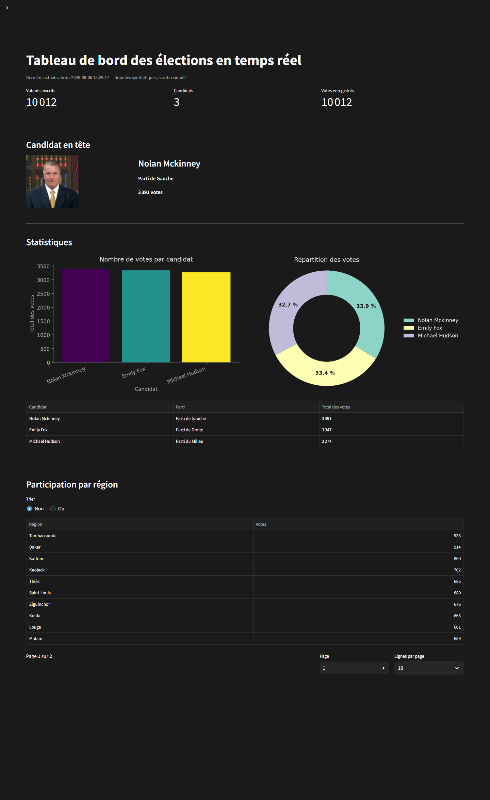

# Vote électoral en temps réel — Kafka, Spark, PostgreSQL

[](https://github.com/NandoDP/vote-temps-reel-data-engineering/actions/workflows/tests.yml)

Pipeline de données en continu qui simule un scrutin, agrège les votes au fil de l'eau et les
affiche sur un tableau de bord temps réel. L'infrastructure tourne en conteneurs.

**Objectif de l'exercice** : mettre en œuvre de bout en bout une chaîne de traitement en
continu — production d'événements, transport par bus de messages, agrégation, restitution —
plutôt que d'en lire la théorie.

## Origine du projet

Ce projet a été construit **en suivant un tutoriel vidéo** consacré à une architecture de
streaming complète. L'architecture n'est pas de ma conception : c'est un exercice
d'apprentissage, et il est présenté comme tel.

Ce que j'y ai apporté au-delà du tutoriel :

- **localisation de la simulation au Sénégal** : les votants sont répartis sur les 45
  départements, avec la région déduite du département ;
- **remise en état pour un tiers** : configuration extraite dans `.env`, chemins résolus depuis
  l'emplacement des scripts, version du connecteur Kafka dérivée de celle de Spark ;
- **corrections de fond** relevées à la relecture : intégrité du schéma (un votant ne peut plus
  voter deux fois), validation des offsets Kafka, fermeture des connexions, messages Kafka
  invalides écartés des agrégats.

Ce qui vient du tutoriel : le découpage en quatre étages, le choix des technologies, la forme
des agrégations et l'idée du tableau de bord.

## Architecture

```
randomuser.me  ──►  main.py          ──►  PostgreSQL  (candidats, votants)
                    (génération)      └─►  Kafka  voters_topic
                                                │
                              voting.py  ◄──────┘
                    (tirage du vote + enrichissement candidat depuis PostgreSQL)
                                    │
                                    ├─►  PostgreSQL  (votes)
                                    └─►  Kafka  votes_topic
                                                │
                          spark_streaming.py  ◄─┘
                            (deux agrégations cumulées)
                                    │
                                    ├─►  Kafka  aggregated_votes_per_candidate
                                    └─►  Kafka  aggregated_turnout_by_location
                                                │
                                     app.py  ◄──┘
                                   (Streamlit, temps réel)
```

**Quatre sujets Kafka, deux agrégations Spark Structured Streaming** : nombre de votes par
candidat, et participation par région.

## Stack

| Brique | Technologie |
|---|---|
| Bus de messages | Apache Kafka (Confluent Platform 7.4.0) |
| Coordination | Apache Zookeeper, avec *healthcheck* |
| Traitement en continu | Apache Spark 3.5 — Structured Streaming |
| Stockage | PostgreSQL 14 |
| Restitution | Streamlit |
| Conteneurisation | Docker Compose |
| Génération de données | API `randomuser.me` |

## Démarrage

Prérequis :

- **Docker** (avec Docker Compose v2)
- **Python 3.10+**
- **Un JDK 8, 11 ou 17**, accessible via `JAVA_HOME`. Spark 3.5 ne fonctionne pas avec un JDK
  plus récent : `java -version` doit afficher l'une de ces trois versions.
- Un accès réseau au premier lancement : le connecteur Kafka de Spark est téléchargé depuis
  Maven Central.

```bash
# 1. Configuration (mots de passe, nombre de votants, débit)
cp .env.example .env

# 2. Bus de messages et base de données
docker compose up -d

# 3. Dépendances Python
pip install -r requirements.txt

# 4. Tables PostgreSQL + génération des votants -> Kafka (voters_topic)
python main.py

# 5. Agrégation Spark en continu -> sujets agrégés
python spark_streaming.py

# 6. Génération des votes -> Kafka (votes_topic)      [nouveau terminal]
python voting.py

# 7. Tableau de bord temps réel                        [nouveau terminal]
streamlit run app.py
```

Les étapes 5, 6 et 7 tournent en parallèle, chacune dans son terminal, et s'arrêtent avec
`Ctrl+C`. L'ordre entre elles est indifférent : les quatre sujets Kafka sont créés
explicitement au démarrage de chaque étage. Lancer Spark en premier évite simplement
d'attendre son initialisation (une quinzaine de secondes) pour voir le tableau de bord se
remplir.

### Réglages

Tout se règle dans `.env` (voir `.env.example`) :

| Variable | Défaut | Rôle |
|---|---|---|
| `NB_VOTANTS` | `1000` | nombre de votants générés par `main.py` |
| `NB_CANDIDATS` | `3` | nombre de candidats |
| `DELAI_ENTRE_VOTES` | `0` | pause entre deux votes, en secondes. `0` = débit maximal ; `0.2` pour voir le tableau de bord se remplir lentement |
| `TAILLE_LOT_PROFILS` | `500` | profils récupérés par requête sur `randomuser.me` |
| `POSTGRES_*`, `KAFKA_BOOTSTRAP_SERVERS` | voir `.env.example` | connexions |

## Tests

60 tests unitaires, exécutés à chaque poussée par GitHub Actions sur Python 3.10 et 3.12.
Ils tournent **sans Kafka, sans Spark et sans PostgreSQL** : la connexion à la base est
remplacée par un double de test, et les profils `randomuser.me` par une fixture. La suite
prend moins d'une seconde.

```bash
pip install -r requirements-dev.txt
pytest tests/ -q
```

| Fichier | Ce qu'il couvre |
|---|---|
| `tests/test_construire_votant.py` | Réécriture de la géographie : le pays devient « Sénégal », la région découle du département et non du profil britannique d'origine. Les 45 départements sont vérifiés un par un, et les 14 régions doivent toutes être atteignables. |
| `tests/test_idempotence_vote.py` | « Un votant ne vote qu'une fois » au rejeu Kafka : dix rejeux du même message ne produisent qu'une voix, un votant ne peut pas changer d'avis, et la transaction est validée même lorsque l'insertion est refusée. |

**Ce qui n'est pas couvert** : les agrégations Spark, qui demandent d'abord d'extraire les
`groupBy` dans des fonctions prenant un `DataFrame` en argument (voir « Perspectives ») ; et
la justesse du SQL lui-même, qui exige une vraie base — un test d'intégration avec un
conteneur PostgreSQL jetable, pas un test unitaire.

## Ce que le projet met en œuvre

- **Découplage producteur / consommateur** par sujets Kafka : chaque étage peut être arrêté et
  relancé sans perdre le flux, les offsets étant validés côté consommateur.
- **Agrégation en continu** avec Spark Structured Streaming plutôt qu'un comptage en base :
  chaque mise à jour d'agrégat est republiée sur Kafka en mode `update`.
- **Enrichissement du flux** : chaque vote est complété des informations de son candidat, lues
  une fois au démarrage depuis PostgreSQL, avant publication sur `votes_topic`.
- **Dépendances de démarrage maîtrisées** : le broker Kafka n'est lancé qu'une fois Zookeeper
  déclaré sain (*healthcheck* dans `docker-compose.yml`).
- **Idempotence des rejeux** : un votant rejoué par Kafka ne produit pas un second vote
  (`votant_id` est clé primaire de `votes`, et les insertions utilisent `ON CONFLICT`).

## Schéma des données

Trois tables, créées par `main.py` :

| Table | Clé | Contenu |
|---|---|---|
| `candidats` | `candidat_id` | nom, parti, biographie, plateforme, photo |
| `votants` | `votant_id` | état civil, adresse (département et région), contact |
| `votes` | `votant_id` | candidat choisi, horodatage UTC — un vote par votant |

Les sujets Kafka `aggregated_votes_per_candidate` et `aggregated_turnout_by_location`
transportent respectivement `{candidat_id, candidat_nom, parti, url_photo, total_votes}` et
`{region, total_votes}`.

## Mesures

Relevés sur une machine **Intel Core i5-1235U (10 cœurs / 12 threads), 16 Go de RAM,
Windows 11**, tous les services sur le même hôte — Kafka, Zookeeper et PostgreSQL en
conteneurs, Spark en `local[*]`.

| Mesure | Valeur |
|---|---|
| Génération des votants (`main.py`) | **8 000 votants en 39,8 s**, soit ~200 votants/s — récupération HTTP, insertion PostgreSQL et publication Kafka comprises |
| Débit des votes (`voting.py`) | **59,3 votes/s** en moyenne sur la course complète (9 900 votes en 167 s), avec des pointes à 75 votes/s sur une seconde |
| Test complet | **10 000 votants → 10 000 votes**, en **2 min 52 s** pour l'étage de vote (~50 s de génération en amont) |
| Latence de bout en bout | **médiane 2,1 s** (min 1,7 s, max 3,1 s sur 12 mesures) |

La latence mesure le trajet complet `voters_topic` → `voting.py` → PostgreSQL →
`votes_topic` → Spark → `aggregated_votes_per_candidate` : un votant est injecté sur le
premier sujet, et l'on chronomètre l'arrivée de la mise à jour d'agrégat correspondante,
pipeline au repos.

**Démarrage à froid** : le premier agrégat suivant le lancement de `spark_streaming.py` met
nettement plus longtemps — une douzaine de secondes, le temps que la requête initialise son
état depuis le point de reprise. Les mesures ci-dessus portent sur un pipeline déjà chaud.

**Ce que le tableau de bord affiche en plus** : il relit les sujets d'agrégats à chaque
actualisation, ce qui ajoute la lecture des sujets (jusqu'à 8 s) et l'intervalle
d'actualisation choisi (10 à 60 s, 15 s par défaut). Le délai perçu à l'écran est donc de
l'ordre de la dizaine de secondes, dominé par cet intervalle et non par le pipeline.

**Où se situe le goulot d'étranglement** : `voting.py` effectue un `INSERT` suivi d'un
`COMMIT` par vote, soit un aller-retour PostgreSQL à chaque vote. C'est ce qui plafonne le
débit autour de 60 votes/s, pas Kafka ni Spark. Grouper les écritures le relèverait, au prix
de la granularité de l'enregistrement.



<sub>Capture régénérable avec `python docs/capture_dashboard.py` (nécessite `pip install
playwright`, volontairement hors de `requirements.txt`).</sub>

## Limites connues

- Les données sont **synthétiques** : les votants proviennent de `randomuser.me` et les partis
  (« Parti de Gauche », « Parti de Droite », « Parti du Milieu ») sont fictifs. Le projet
  démontre la chaîne technique, pas une analyse électorale réelle.
- L'agrégation tourne en **Spark local** (`local[*]`), sans cluster : le comportement en
  environnement distribué n'est pas démontré ici. Spark n'apparaît donc pas dans
  `docker-compose.yml`.
- Les agrégats sont **cumulés depuis le début du flux**, sans fenêtre temporelle : le tableau de
  bord affiche un total courant. L'état Spark reste borné parce que les clés de regroupement
  sont peu nombreuses (autant que de candidats, puis que de régions).
- Le tableau de bord **relit l'intégralité des sujets d'agrégats** à chaque actualisation. C'est
  suffisant à cette échelle, mais le coût croît avec le nombre de messages publiés.
- Les garanties de livraison sont **« au moins une fois »** : les offsets étant validés par
  paquets de cent, un redémarrage de `voting.py` peut rejouer jusqu'à cent votants. Les
  contraintes du schéma absorbent ces doublons.
- **L'écriture en base et la publication Kafka ne sont pas atomiques.** `voting.py` enregistre
  le vote, puis le publie. Un arrêt brutal entre les deux laisse un vote présent en base mais
  jamais publié : au redémarrage, le `ON CONFLICT` le considère déjà traité et ne le republie
  pas. Le tableau de bord afficherait alors un total d'agrégats inférieur au décompte en base.
  Le risque est faible et la fenêtre étroite, mais elle existe.
- **Pas de tests automatisés.**

## Dépannage

| Symptôme | Cause probable |
|---|---|
| `Connexion à PostgreSQL impossible` | conteneurs non démarrés (`docker compose ps`), ou `.env` absent |
| Spark échoue au démarrage avec une erreur Java | JDK trop récent — Spark 3.5 exige un JDK 8, 11 ou 17 |
| Le tableau de bord affiche « Aucun agrégat » | `spark_streaming.py` n'a pas encore produit ; compter une quinzaine de secondes après son démarrage |
| `Aucun candidat en base` au lancement de `voting.py` | `main.py` n'a pas été exécuté |
| `UnsatisfiedLinkError: NativeIO$Windows.access0` (Windows) | `hadoop.dll` introuvable. Installer `winutils.exe` et `hadoop.dll` dans le sous-répertoire `bin` de `HADOOP_HOME` — `spark_streaming.py` ajoute ce répertoire au `PATH` de lui-même, mais les fichiers doivent exister |
| Spark reste bloqué au premier lancement | Ivy télécharge le connecteur Kafka depuis Maven Central : compter une minute et un accès réseau |
| `RpcEndpointNotFoundException` après une mise en veille | L'adresse IP de la machine a changé sous Spark. Le pilote est lié à `127.0.0.1` pour éviter cela ; si le cas survient malgré tout, relancer `spark_streaming.py` — le point de reprise permet de repartir sans perte |

## Perspectives

Par ordre de ce que chaque chantier apporterait. Les trois premiers répondent aux faiblesses
que je vois moi-même dans ce dépôt : elles sont nommées ici plutôt que laissées à découvrir.

### 1. Des tests et une intégration continue

C'est ce qui manque le plus, et c'est le moins coûteux. Les parties les plus testables sont
justement celles qui ne le sont pas : la table département vers région (les 45 départements
retombent-ils bien sur 14 régions ?), `construire_votant`, la désérialisation d'un message
malformé, l'idempotence d'un rejeu.

Deux préalables concrets :

- ~~renommer `spark-streaming.py`~~ — fait : le module s'appelle désormais
  `spark_streaming.py`, le tiret le rendait non importable donc non testable ;
- extraire les agrégations dans des fonctions prenant un `DataFrame` en argument, ce qui
  permet de les vérifier sur un jeu statique, sans Kafka ni flux.

Puis un workflow GitHub Actions qui lance `pytest` et un `ruff check`. Un dépôt de streaming
sans un seul test se voit immédiatement, et « comment testez-vous un pipeline en continu ? »
est une question d'entretien courante.

### 2. Conteneuriser les scripts, pas seulement l'infrastructure

Aujourd'hui `docker compose` ne couvre que Kafka, Zookeeper et PostgreSQL. Le code, lui,
exige de la machine hôte un Python, un JDK d'une version précise, et sous Windows
`winutils.exe` et `hadoop.dll`. C'est une conteneurisation à moitié faite.

Un `Dockerfile` pour les scripts Python, ajouté au `compose`, ramènerait le démarrage à une
seule commande et supprimerait la moitié de la section « Dépannage » ci-dessus — y compris
l'amorce Windows de `spark_streaming.py`, qui n'aurait plus lieu d'être.

### 3. Lever le goulot d'étranglement mesuré

Les mesures désignent le coupable : un `INSERT` suivi d'un `COMMIT` par vote, soit un
aller-retour PostgreSQL à chaque événement, qui plafonne le débit autour de 60 votes/s.
Regrouper les écritures par lots (`execute_values`, déjà utilisé dans `main.py`) le
relèverait nettement.

La contrepartie est réelle et mérite d'être mesurée plutôt que supposée : on perd la
granularité de l'enregistrement, et un arrêt brutal coûte un lot entier au lieu d'un vote.
L'intérêt de l'exercice est là — chiffrer le gain et le risque, pas choisir à l'aveugle.

### Rendre la chaîne plus rigoureuse

- **Agrégation en fenêtre** (`window` et filigrane) à côté des totaux cumulés, pour restituer
  un rythme de vote et non seulement un cumul. C'est aussi ce qui donnerait enfin un rôle au
  filigrane, inutile sur une agrégation globale.
- **Schema Registry et Avro** à la place du `StructType` écrit à la main. Aujourd'hui un
  message malformé produit une ligne nulle, écartée par un filtre ; un registre de schémas
  rendrait le contrat explicite et versionné.
- **Rendre atomiques l'écriture et la publication** — voir la limite décrite plus haut. Un
  motif *outbox*, où la publication Kafka découle d'une table de sortie alimentée dans la même
  transaction que le vote, supprimerait la fenêtre de perte.
- **KRaft** à la place de Zookeeper : un conteneur de moins, et le mode vers lequel Kafka a
  convergé.
- **Observabilité** : un `StreamingQueryListener` exposant durée de micro-lot et débit
  d'entrée, plutôt que de déduire l'état du pipeline en comptant des lignes en base.

### Changer la nature de l'exercice

- **Mettre l'architecture à l'épreuve.** À la charge actuelle — 3 clés candidat, 14 clés
  région, 60 votes/s — Kafka et Spark ne sont pas nécessaires : un seul processus Python y
  suffirait. Ce qui rendrait le choix défendable, c'est de le mettre en difficulté :
  partitionner `voters_topic`, lancer plusieurs `voting.py` en parallèle sur le même groupe de
  consommateurs, et mesurer si le débit suit. C'est le seul chemin qui transforme cet exercice
  en démonstration de passage à l'échelle, et non plus seulement d'assemblage.
- **Passer Spark en mode cluster**, une fois qu'il y a une charge qui le justifie.
- **Remplacer les votants synthétiques par un jeu de données réel** — données démographiques
  publiques sénégalaises, par exemple. Le pipeline resterait le même ; ce sont les questions
  posées aux données qui deviendraient intéressantes.
